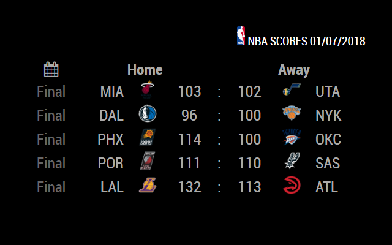

# MMM-NBA

NBA Score modules for MM2

I like the look of fewieden's NHL and NFL score moduels, so modified cowboysdude's NBA module to match.

~MagicMirror/modules

git clone https://github.com/bgibz/MMM-NBA

Edit your config.js:

Config Options:
    header: header describing module purpose and current date
    logo: NBA logo in header, requires header set to true
    colored: true = full colour logos, false = grayscale
    games: number of games to list at once
    updateInterval: 60000 how often in milliseconds to refresh data
                   
		   Example:

 ____________________________________CONFIG.JS_____________________________________
          
	   {
			module: 'MMM-NBA',
			position: 'middle_center',
			config: {
				maxWidth: "500px",
				header: true,
				logo: true,
				colored: true,
				games: 6,
				updateInterval: 60000
			}
		},

________________________________________________________________________________________

finally, run npm install from the MMM-NBA directory.
